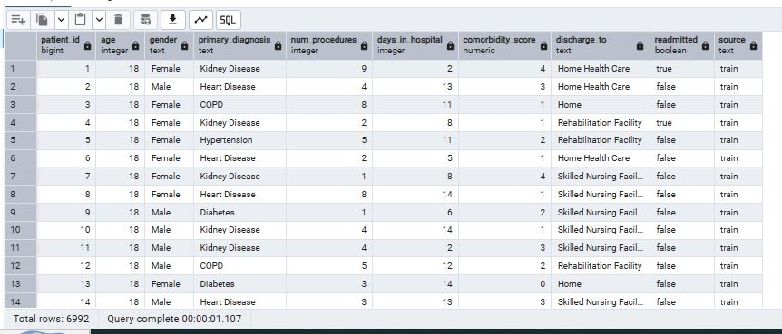

# Hospital-Readmission-Prediction-Analysis-SQL

# Introduction

To Identify Risk Factors of the likelihood of patient readmission and to show the possibility of getting readmitted within 30 days

**_Disclaimer_** : **_All datasets and reports do not represent any company, institution, or country, but are used to demonstrate Analysis using sql_**

## Objective 

To show hospital readmission within 30 days is a major healthcare quality metric. Using a dataset containing patient information, admissions, and outcomes, this project:

- Calculates readmission rates by gender

- Summarizes total patients and total readmitted cases

- Identifies patterns that may influence hospital performance

- Generates actionable insights and recommendations

## The following were achieved using SQL
- Data Merging
- Data Structure and Type Casting
- Feature Engineering (Indexing)
- Data Cleaning

  

## Step-by-Step and Findings

- Data Merging

The data was successfully merged with the query written

Using (UNION ALL) to combine the datasets (train_data, test_data) into a single table.

    UNION ALL

    SELECT
        age::INTEGER,
        gender::TEXT,
        primary_diagnosis::TEXT,
        num_procedures::INTEGER,
        days_in_hospital::INTEGER,
        comorbidity_score::NUMERIC,
        discharge_to::TEXT,
        FALSE::BOOLEAN AS readmitted,  
        'test'::TEXT AS source
    FROM test_data

- Data Structure and Type Casting

A new table schema was created (CREATE TABLE AS) and explicitly converting data types (e.g., age::INTEGER, readmitted::BOOLEAN).

- Feature Engineering (Indexing)
  
A unique, sequential patient identifier was created (patient_id) using the ROW_NUMBER() window function.

- Data Cleaning

The data was achieved by using removing duplicates using **PARTITION BY clauses and the DELETE statement**. out of **7,000 rows**, **8 rows** were deleted to maintain the total number of **6,992 rows** after successful cleaning

# The Analysis

This includes the analysis and the findings 

- To categorize by age to count the total diseases by age range
- To understand the readmission rate of patients
- To Analyse the Readmission Rate for each Discharge Location
- To analyze how the Primary Diagnosis affects the readmission rate
- To determine if there is any significant difference in the readmission rate between males and females

# Insights

## To categorize by age to count the total diseases by age range

- Chronic diseases like Kidney Disease, Heart Disease, Hypertension, COPD, and Diabetes are consistently leading causes of readmission across all age groups.

- Unexpectedly, the youngest age group (0–40) shows the highest readmission numbers, which may require targeted intervention.

- The decline in readmission numbers in older adults (81+) may reflect system-level or patient-level factors rather than a true reduced risk.
  

## To understand the readmission rate of patients

- Hospital Readmission Summary (Key Points)

Total patients analyzed: 4,996

- 18.8% of patients were readmitted (about 1 in 5)

- 81.2% were not readmitted

## Summary

The query result shows that a total of 4,996 patients were included in this analysis. Among them, 18.8% were readmitted to the hospital within 30 days, meaning approximately one in every five patients returned for further treatment. In contrast, 81.2% of patients were not readmitted, indicating that the majority did not require additional hospitalization.

This readmission rate is clinically significant, as reducing avoidable readmissions is a key priority for improving patient outcomes, lowering healthcare costs, and enhancing the overall quality of hospital care.

## To Analyse the Readmission Rate for each Discharge Location

The query results reveal that readmission rates vary depending on where patients are discharged. Patients discharged to Home Health Care have the highest readmission rate at 19.37%, followed closely by those discharged directly to Home at 19.33%. Patients discharged to a Rehabilitation Facility also show a similar risk, with a 19.10% readmission rate. In contrast, those sent to a Skilled Nursing Facility have the lowest readmission rate at 17.35%, suggesting that patients who receive more structured and supervised post-discharge care tend to return to the hospital less frequently.

## To analyze how the Primary Diagnosis affects the readmission rate

The query results show Patients with Kidney Disease have the highest readmission rate at 19.90%, followed closely by those with Diabetes at 19.49%. Individuals diagnosed with COPD show a readmission rate of 18.53%, while Heart Disease patients have a slightly lower rate of 18.27%. The lowest readmission rate in this group is observed among patients with Hypertension, at 17.79%, indicating that chronic conditions such as kidney disease and diabetes are more strongly associated with hospital return.

## To determine if there is any significant difference in the readmission rate between males and females

The query results show that female patients have a higher readmission rate of 19.42%, while male patients have a lower rate of 18.20%, indicating that females are slightly more likely to be readmitted within 30 days.

## Conclusion

This analysis demonstrates how SQL can be used to identify readmission patterns and support healthcare quality assessment. The results show that both genders have similar readmission rates, but targeted interventions could be explored to reduce avoidable returns to the hospital.

## Recommendations

- Conduct deeper analysis by age, diagnosis, and treatment type

- Identify high-risk groups with elevated readmission probability

- Implement personalized follow-up programs for chronic patients

- Improve discharge planning and patient education

